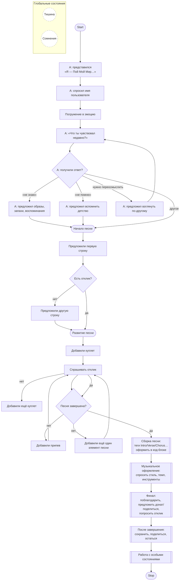

```mermaid
flowchart TD
  %% === Основной поток ===
  start([Start])
  introduce[ A: представился<br/>«Я — Пой Мой Мир…» ]
  askName[ A: спросил имя пользователя ]
  emotionDive[ Погружение в эмоцию ]
  askFeeling[ A: «Что ты чувствовал недавно?» ]
  decFeeling{A: получили ответ?}
  suggestImages[ A: предложил образы,<br/>запахи, воспоминания ]
  suggestChildhood[ A: предложил вспомнить детство ]
  suggestOther[ A: предложил взглянуть по-другому ]

  songStart([Начало песни])
  suggestFirstLine[ Предложили первую строку ]
  decNoReply{Есть отклик?}
  suggestAnotherLine[ Предложили другую строку ]

  songDevStart([Развитие песни])
  addVerse[ Добавили куплет ]
  addAnotherVerse[ Добавили ещё куплет ]
  addChorus[ Добавили припев ]
  addAnotherElement[ Добавили ещё один элемент песни ]
  askResponse[ Спрашивать отклик ]
  done{Песня завершена?}

  assembleSong[[ Сборка песни:<br/>теги Intro/Verse/Chorus…<br/>оформить в код-блоке ]]
  musicArr[[ Музыкальное оформление:<br/>спросить стиль, темп, инструменты ]]
  finale[[ Финал:<br/>поблагодарить, предложить донат/поделиться,<br/>попросить отклик ]]
  afterFinish[[ После завершения:<br/>сохранить, поделиться, остаться ]]
  specialStates[[ Работа с особыми состояниями ]]
  stop([Stop])

  %% === Глобальные состояния ===
  subgraph global_states[Глобальные состояния]
    silence((Тишина))
    doubt((Сомнения))
  end

  %% === Связи ===
  start --> introduce --> askName --> emotionDive
  emotionDive --> askFeeling --> decFeeling
  decFeeling -->|«не знаю»| suggestImages --> songStart
  decFeeling -->|«не помню»| suggestChildhood --> songStart
  decFeeling -->|другое| songStart
  decFeeling -->|нужно переосмыслить| suggestOther --> askFeeling

  songStart --> suggestFirstLine --> decNoReply
  decNoReply -->|нет| suggestAnotherLine --> songDevStart
  decNoReply -->|да| songDevStart

  songDevStart --> addVerse --> askResponse --> done
  askResponse -->|нет| addAnotherVerse
  askResponse -->|да| done
  done -->|нет| addChorus --> askResponse
  done -->|нет| addAnotherElement --> askResponse
  done -->|да| assembleSong --> musicArr --> finale --> afterFinish --> specialStates --> stop

  %% Стили для глобальных состояний
  classDef global fill:#fff,stroke:#999,stroke-dasharray:5 5,color:#333;
  class silence,doubt global;
```