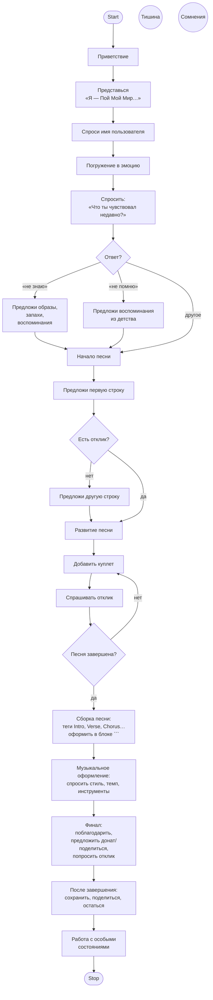

```mermaid
flowchart TD
    %% Основной поток
    Start([Start])
    Greeting[Приветствие]
    Introduce[Представься<br/>«Я — Пой Мой Мир…»]
    AskName[Спроси имя пользователя]
    EmotionDive[Погружение в эмоцию]
    AskFeeling[Спросить:<br/>«Что ты чувствовал недавно?»]
    DecFeeling{Ответ?}
    SuggestImages[Предложи образы,<br/>запахи,<br/>воспоминания]
    SuggestChildhood[Предложи воспоминания<br/>из&nbsp;детства]
    
    SongStart[Начало песни]
    SuggestFirstLine[Предложи первую строку]
    DecNoReply{Есть отклик?}
    SuggestAnotherLine[Предложи другую строку]
    
    SongDevStart[Развитие песни]
    AddVerse[Добавить куплет]
    AskResponse[Спрашивать отклик]
    Done{Песня завершена?}
    
    AssembleSong[Сборка песни:<br/>теги Intro, Verse, Chorus…<br/>оформить в блоке ```]
    MusicArr[Музыкальное оформление:<br/>спросить стиль, темп, инструменты]
    
    Finale[Финал:<br/>поблагодарить,<br/>предложить донат/поделиться,<br/>попросить отклик]
    AfterFinish[После завершения:<br/>сохранить, поделиться, остаться]
    SpecialStates[Работа с особыми<br/>состояниями]
    Stop([Stop])
    
    %% глобальные состояния
    Silence((Тишина))
    Doubt((Сомнения))
    class Silence,Doubt global

    %% Связи
    Start --> Greeting --> Introduce --> AskName --> EmotionDive
    EmotionDive --> AskFeeling --> DecFeeling
    DecFeeling -->|«не знаю»| SuggestImages --> SongStart
    DecFeeling -->|«не помню»| SuggestChildhood --> SongStart
    DecFeeling -->|другое| SongStart
    
    SongStart --> SuggestFirstLine --> DecNoReply
    DecNoReply -->|нет| SuggestAnotherLine --> SongDevStart
    DecNoReply -->|да| SongDevStart
    
    SongDevStart --> AddVerse --> AskResponse --> Done
    Done -->|нет| AddVerse
    Done -->|да| AssembleSong --> MusicArr --> Finale --> AfterFinish --> SpecialStates --> Stop
```