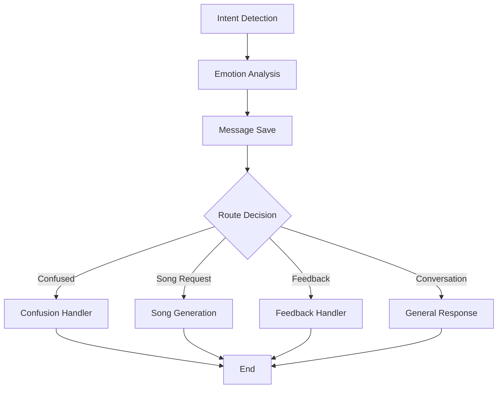

# LangGraph Refactoring Summary

## Overview
Successfully refactored the poymoymir project from sequential processing to a LangGraph-based workflow architecture. This transformation improves maintainability, scalability, and debugging capabilities.

## What Was Changed

### 1. Dependencies
- Added LangGraph and LangChain dependencies to `requirements.txt`
- `langgraph>=0.2.0`
- `langchain-core>=0.3.0`
- `typing-extensions>=4.9.0`

### 2. New Files Created

#### `mindset/langgraph_state.py`
- Defines `ConversationState` TypedDict containing all workflow state
- Includes conversation context, analysis results, processing flags
- Provides structured data flow through the graph

#### `mindset/langgraph_nodes.py`
- Implements modular processing nodes:
  - `IntentDetectionNode`: Analyzes user intent
  - `EmotionAnalysisNode`: Detects emotional state
  - `MessageSaveNode`: Saves messages and analysis to database
  - `ConfusionHandlerNode`: Handles confusion responses
  - `SongGenerationNode`: Manages song creation via Suno API
  - `FeedbackHandlerNode`: Processes post-song feedback
  - `ConversationNode`: Handles general AI conversations

#### `mindset/langgraph_workflow.py`
- Creates the LangGraph state machine
- Implements conditional routing logic
- Defines workflow execution flow with proper error handling

### 3. Refactored Files

#### `index.py`
- Replaced sequential processing with LangGraph workflow execution
- Simplified main handler logic
- Improved error handling and state management

## Architecture Benefits

### Before (Sequential)
```
Message → Intent Detection → Emotion Analysis → Conditional Logic → Response
```

### After (LangGraph)


## Key Improvements

### 1. Modularity
- Each processing step is now a separate, testable node
- Clear separation of concerns
- Easy to add new processing steps

### 2. Maintainability
- Workflow logic is centralized and visual
- State management is structured and predictable
- Debugging is easier with step-by-step tracking

### 3. Scalability
- Easy to add parallel processing branches
- Conditional routing supports complex business logic
- Error handling is consistent across all nodes

### 4. Testability
- Individual nodes can be unit tested
- Workflow routing logic is isolated and testable
- State transformations are predictable

## Usage

The refactored system maintains the same external API while using LangGraph internally:

```python
# Initialize workflow
workflow = ConversationWorkflow(
    config, llm, db, utils, telegram_bot,
    suno_manager, moderation_service, logger
)

# Process message (same interface as before)
final_state = workflow.process_message(initial_state)
```

## Error Handling

- Each node handles its own errors gracefully
- Failed nodes don't crash the entire workflow
- Errors are collected in the state for debugging
- Fallback responses ensure user experience continues

## State Management

The `ConversationState` tracks:
- User message and context
- Analysis results (intent, emotion)
- Processing flags (confusion, song states)
- Error collection
- Step completion tracking

## Validation

All files pass Python syntax compilation:
- ✅ `langgraph_state.py`
- ✅ `langgraph_nodes.py`
- ✅ `langgraph_workflow.py`
- ✅ `index.py`

## Next Steps

1. **Deploy and Test**: Test with real Telegram messages
2. **Performance Monitoring**: Monitor workflow execution times
3. **Add Metrics**: Track node success/failure rates
4. **Visualization**: Use LangGraph's built-in visualization tools
5. **Optimization**: Identify bottlenecks and optimize slow nodes

## Migration Notes

- The external API remains unchanged
- All existing functionality is preserved
- Database schema and integrations are unmodified
- Configuration and environment setup is identical

This refactoring provides a solid foundation for future enhancements while maintaining backward compatibility.
